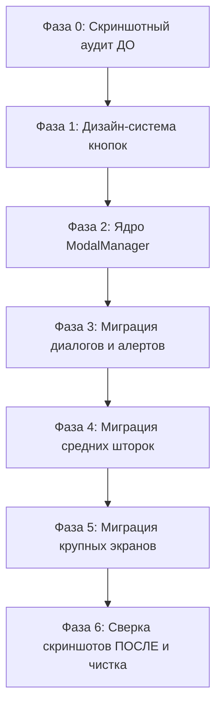

# 📋 Генеральный план и регламент рефакторинга UI: Единая система модальных окон (ModalManager) и Дизайн-система кнопок

> **Статус:** Подготовлен к автономному выполнению (по команде `/goal`)  
> **Целевая ветка Git:** `Refactor`  
> **Принцип выполнения:** Zero Regression (100% сохранение функционала, наполненности и расположения компонентов с проверкой скриншотами «ДО / ПОСЛЕ»).

---

## 📑 Содержание

1. [Цели и задачи рефакторинга](#1-цели-и-задачи-рефакторинга)
2. [Железные правила безопасности (Zero Regression Protocol)](#2-железные-правила-безопасности-zero-regression-protocol)
3. [Методология скриншотного аудита («ДО» и «ПОСЛЕ»)](#3-методология-скриншотного-аудита-до-и-после)
4. [Полный реестр всплывающих окон и меню (38 компонентов)](#4-полный-реестр-всплывающих-окон-и-меню-38-компонентов)
5. [Реестр и классификация кнопок приложения](#5-реестр-и-классификация-кнопок-приложения)
6. [Архитектура новой платформенной системы](#6-архитектура-новой-платформенной-системы)
   * 6.1. Движок модальных окон `ModalManager`
   * 6.2. Унифицированная дизайн-система кнопок
7. [Пошаговый план выполнения работ (Roadmap)](#7-пошаговый-план-выполнения-работ-roadmap)
8. [Критерии приемки и финальная верификация](#8-критерии-приемки-и-финальная-верификация)

---

## 1. Цели и задачи рефакторинга

На текущий момент кодовая база содержит:
* **`index.html` (3 390 строк)**: более 60% файла занято шаблонными блоками бэкдропов и шторок.
* **`css/*.css` / `style.css` (22 780 строк)**: сотни разрозненных классов для шторок, диалогов и кнопок с повторяющимися тенями, отступами и анимациями.
* **`app.js` (26 511 строк)**: более 220 разрозненных методов `open...Modal` и `close...Modal` с дублирующимся кодом кликов по фону, анимаций, виброотклика и сброса скролла.

**Главные задачи:**
1. Разработать единый легковесный движок **`ModalManager`**, который централизованно управляет всеми окнами (открытие, закрытие, анимация, бэкдроп, закрытие свайпом вниз, Esc, клик мимо окна, haptic-отклик).
2. Разработать унифицированную **дизайн-систему кнопок** (`.btn`, `.btn-primary`, `.btn-secondary`, `.btn-danger`, `.btn-icon`) с единой приятной физикой нажатия (`scale(0.96)`).
3. Перевести все меню на компонентную основу, сохранив в точности их наполнение, поля, элементы управления и взаиморасположение.
4. Сократить от **5 000 до 7 000 строк** шаблонного и дублирующегося кода.

---

## 2. Железные правила безопасности (Zero Regression Protocol)

Во время автономного выполнения работ агент строго следует следующим правилам:

1. **Работа строго в ветке `Refactor`**: основная ветка `main` остается в полной неприкосновенности.
2. **Точки сохранения (Checkpoints)**: создание контрольных git-коммитов после каждого успешно завершенного этапа.
3. **Неприкосновенность бизнес-логики**: расчет калорий, макросов Миффлина — Сан-Жеора, баланса финансов, фаз менструального цикла, состояния тамагочи и квестов мейн-куна **не изменяются**. Все обработчики событий (`submit`, `input`, `change`) сохраняют свои сигнатуры.
4. **Сохранение ID и обратная совместимость (Aliasing)**: ключевые ID элементов (`#taskModalBackdrop`, `#editTabModalBackdrop`, `#nutritionModalBackdrop` и т.д.) сохраняются или маппятся через прокси-свойства, чтобы сторонние вызовы или тесты не упали с ошибкой `Cannot read properties of null`.
5. **Сборка CSS через `scripts/build.cjs`**: изменения стилей вносятся исключительно в модульные файлы папки `css/*.css`, после чего компилируются командой `node scripts/build.cjs` в `style.css` и `www/`.
6. **Обязательное тестирование синтаксиса**: перед каждым коммитом выполняется `npm test` (`node -c` по всем 14 JS-файлам).

---

## 3. Методология скриншотного аудита («ДО» и «ПОСЛЕ»)

Для гарантии того, что компоненты, поля и кнопки не сместятся и не потеряются, применяется визуальный аудит:

1. **Каталоги скриншотов:**
   * `audit_screenshots/baseline/` — эталонные скриншоты исходного состояния ДО начала изменений.
   * `audit_screenshots/refactored/` — скриншоты окон ПОСЛЕ перевода на новую компонентную основу.
2. **Метод фиксации:**
   * Запуск локального сервера `server.cjs` (порт 3000).
   * Автоматизированное открытие каждого окна с тестовыми данными.
   * Фиксация полноразмерного снимка окна (viewport и sheet-container).
3. **Критерии сравнения:**
   * **Полнота наполнения**: все текстовые метки, инпуты, иконки, подсказки и селекторы присутствуют на экране.
   * **Взаимное расположение**: порядок блоков сверху вниз строго сохранен (хедер с заголовком и крестиком -> тело формы -> футер с кнопками действий).
   * **Кнопки**: все кнопки сабмита, отмены и удаления находятся на своих привычных местах.

---

## 4. Полный реестр всплывающих окон и меню (38 компонентов)

Каждое окно отнесено к одному из 4 архитектурных архетипов:
* **[FULL_SHEET]** — большая полноэкранная шторка (высота 85–95vh, скролл содержимого).
* **[COMPACT_DIALOG]** — модальный диалог фиксированного размера по центру экрана.
* **[ACTION_SHEET]** — шторка быстрых действий (выезжает снизу).
* **[POPOVER]** — всплывающее меню / контекстный поповер, привязанный к элементу.

---

### Группа 1: Блокнот, задачи, вкладки и организация (8 окон)

| № | Название в UI | Селектор / ID | Архетип | Способ вызова (Триггер) | Ключевые компоненты внутри |
|---|---|---|---|---|---|
| 1 | **Новая запись / Редактирование записи** | `#taskModalBackdrop`, `#taskModalSheet` | `[FULL_SHEET]` | Кнопка «+» на листе или клик по задаче | Табы типов (Заметка, Список, Привычка), инпут текста, выбор даты/времени, приоритет (флажки), прикрепление фото, выбор блока |
| 2 | **Новая вкладка** | `#newTabModalBackdrop` | `[COMPACT_DIALOG]` | Кнопка «+» в строке вкладок блокнота | Поле ввода названия списка/вкладки, кнопки «Отмена» и «Создать вкладку» |
| 3 | **Настройка вкладки** | `#editTabModalBackdrop` | `[COMPACT_DIALOG]` | Долгое нажатие (Long-press) на корешок вкладки | Инпут переименования, палитра цвета ярлычка, выбор фонового паттерна листа (клетка, точка, линейка, крафт), кнопки «Очистить» и «Удалить» |
| 4 | **Новый блок (раздел)** | `#newSectionModalBackdrop` | `[COMPACT_DIALOG]` | Кнопка «+ Добавить блок» на листе | Инпут названия раздела, сетка выбора эмодзи-иконки, выбор цвета акцента, сабмит |
| 5 | **Управление блоком (Меню раздела)** | `#sectionMenuModalBackdrop` | `[ACTION_SHEET]` | Долгое нажатие на заголовок блока | Кнопки: «Переименовать», «Свернуть/Развернуть», «Сменить цвет/эмодзи», «Переместить вверх/вниз», «Удалить блок» |
| 6 | **📅 Календарь блокнота** | `#calendarModalBackdrop` | `[FULL_SHEET]` | Клик по виджету даты в шапке | Навигация по месяцам (`<` `>`), сетка дней с точками активности, кнопка возврата к сегодня |
| 7 | **📸 Поделиться днём (Экспорт листа)** | `#sheetExportModalBackdrop` | `[FULL_SHEET]` | Кнопка «📸» в углу листа блокнота | Контейнер предпросмотра сгенерированной открытки, дата-бейдж, кнопки «Скачать изображение» и «Поделиться» |
| 8 | **Просмотрщик картинок (Lightbox)** | `#imageLightboxBackdrop` | `[POPOVER]` | Тап по фото в задаче/заметке | Полноэкранное изображение на темном фоне, кнопка закрытия |

---

### Группа 2: Питание и баланс КБЖУ (9 окон)

| № | Название в UI | Селектор / ID | Архетип | Способ вызова (Триггер) | Ключевые компоненты внутри |
|---|---|---|---|---|---|
| 9 | **🥑 Питание (Главный экран)** | `#nutritionModalBackdrop` | `[FULL_SHEET]` | Виджет `🥑` в шапке / меню `✦` | Шкала сытости с котиком, кольца калорий и БЖУ, список приёмов пищи (Завтрак, Обед, Ужин, Перекус), кнопки добавления |
| 10 | **Добавить еду** | `#nutritionAddFoodModalBackdrop` | `[FULL_SHEET]` | Кнопка «+ Добавить» в приёме пищи | Поисковая строка по базе (АТБ, Сильпо, OFF), кнопка сканера штрихкода, вкладка ручного ввода, инпут веса (граммы), сабмит |
| 11 | **Сканер штрихкодов продуктов** | `#nutritionBarcodeScannerModalBackdrop` | `[FULL_SHEET]` | Кнопка штрихкода в добавлении еды | Видоискатель камеры с прицелом, кнопка включения фонарика (вспышки), кнопка закрытия |
| 12 | **🥑 Статистика питания** | `#nutritionStatsModalBackdrop` | `[FULL_SHEET]` | Иконка графика в шапке питания | Селекторы периодов (Неделя, Месяц), графики калоража и баланса белков/жиров/углеводов |
| 13 | **⚙️ Настройки питания** | `#nutritionSettingsModalBackdrop` | `[FULL_SHEET]` | Шестерёнка в шапке питания | Поля целевых калорий, белков, жиров, углеводов, переключатели приёмов пищи, кнопка вызова калькулятора |
| 14 | **🪄 Калькулятор норм КБЖУ** | `#nutritionCalcModalBackdrop` | `[FULL_SHEET]` | Кнопка «🪄 Рассчитать норму» в настройках | Поля: пол, возраст, рост, вес, уровень активности, цель (похудение/поддержание/набор), итоговый расчет |
| 15 | **Редактировать приём пищи** | `#editMealModalBackdrop` | `[COMPACT_DIALOG]` | Карандаш рядом с приёмом пищи | Инпут названия, сетка выбора иконки еды, кнопка «Удалить приём», сабмит |
| 16 | **Цвет макронутриента (БЖУ)** | `#macroColorModalBackdrop` | `[COMPACT_DIALOG]` | Лонг-пресс на столбец Белки/Жиры/Углеводы | Палитра выбора цвета для конкретного макроса, кнопки «Отмена» и «Применить» |
| 17 | **Выбор окраса котика сытости** | `#hungerCatColorPopup` | `[POPOVER]` | Лонг-пресс или правый клик по котику сытости | Компактная плашка с 6 вариантами окраса шерсти котика |

---

### Группа 3: Финансы (4 окна)

| № | Название в UI | Селектор / ID | Архетип | Способ вызова (Триггер) | Ключевые компоненты внутри |
|---|---|---|---|---|---|
| 18 | **💰 Финансы (Главный экран)** | `#financeModalBackdrop` | `[FULL_SHEET]` | Виджет `₴` в шапке / меню `✦` | Блок баланса, кольцевая диаграмма расходов, список категорий, кнопка добавления категории, лента истории операций |
| 19 | **Ввод суммы операции (Калькулятор)** | `#financeEntryModalBackdrop` | `[COMPACT_DIALOG]` | Тап по категории или кнопка «+» в финансах | Цифровая клавиатура калькулятора, поле ввода комментария, кнопка выбора даты, сабмит, удаление |
| 20 | **Управление категорией финансов** | `#financeCategoryModalBackdrop` | `[COMPACT_DIALOG]` | Кнопка «+ Категория» или лонг-пресс по категории | Инпут названия, переключатель расход/доход, сетка пикера иконок, лимит бюджета, сабмит |
| 21 | **📅 Дата финансовой операции** | `#financeDatePickerModalBackdrop` | `[COMPACT_DIALOG]` | Клик по дате в калькуляторе ввода суммы | Мини-календарь текущего месяца для выбора конкретного дня транзакции |

---

### Группа 4: Заметить радость (3 окна)

| № | Название в UI | Селектор / ID | Архетип | Способ вызова (Триггер) | Ключевые компоненты внутри |
|---|---|---|---|---|---|
| 22 | **За что я благодарен сегодня?** | `#joyModalBackdrop` | `[FULL_SHEET]` | Виджет `☀️` в шапке / меню `✦` | Текстовое поле заметки благодарности, выбор настроения, прикрепленный стикер, кнопка перехода в банку, сабмит |
| 23 | **🫙 Банка радости** | `#joyJarModalBackdrop` | `[FULL_SHEET]` | Иконка стеклянной банки в окне радости | Интерактивная банка со свернутыми записками, список сохраненных счастливых воспоминаний |
| 24 | **Выбор бумажного стикера для радости** | `#joyStickerPickerBackdrop` | `[COMPACT_DIALOG]` | Тап по стикеру в форме радости | Сетка стилизованных бумажных стикеров для наклеивания на записку |

---

### Группа 5: Женский календарь и здоровье (2 окна)

| № | Название в UI | Селектор / ID | Архетип | Способ вызова (Триггер) | Ключевые компоненты внутри |
|---|---|---|---|---|---|
| 25 | **🍒 Календарь цикла и здоровья** | `#cycleModalBackdrop` | `[FULL_SHEET]` | Виджет `🍒` в шапке / меню `✦` | Круговой индикатор текущего дня цикла, фазы, прогноз овуляции, история циклов, кнопка добавления отметки |
| 26 | **Запись цикла** | `#cycleAddModalBackdrop` | `[COMPACT_DIALOG]` | Кнопка отметки периода в календаре цикла | Дата начала/конца, интенсивность, чекбоксы симптомов и настроения, заметка, сабмит |

---

### Группа 6: Привычки и регулярные цели (3 окна)

| № | Название в UI | Селектор / ID | Архетип | Способ вызова (Триггер) | Ключевые компоненты внутри |
|---|---|---|---|---|---|
| 27 | **Новая привычка / Редактирование** | `#habitModalBackdrop` | `[FULL_SHEET]` | Кнопка «+ Привычка» на панели привычек | Название, иконка, выбор типа регулярности (каждый день / дни недели / интервал), целевое число, графики прогресса, сабмит |
| 28 | **Выбор периода графиков привычки** | `#habitPeriodDropdownMenu` | `[POPOVER]` | Кнопка периода в модалке привычки | Выпадающие пункты: «Неделя», «Месяц», «Год», «Всё время» |
| 29 | **Быстрый степпер привычки (Popover)** | `#habitStepperBackdrop`, `#habitStepperSheet` | `[POPOVER]` | Тап по числовой привычке на панели | Кнопки уменьшения `-` и увеличения `+`, текущее значение прогресса, кнопка сохранения |

---

### Группа 7: Питомец, геймификация и декор (5 окон)

| № | Название в UI | Селектор / ID | Архетип | Способ вызова (Триггер) | Ключевые компоненты внутри |
|---|---|---|---|---|---|
| 30 | **Виртуальный питомец (Тамагочи)** | `#petModalBackdrop` | `[FULL_SHEET]` | Тап по котику на листе или внизу экрана | Интерактивный котик, шкалы сытости и настроения, кнопки кормления обычным кормом и лакомствами, переименование |
| 31 | **Окрас шерсти питомца** | `#petSettingsPopup` | `[POPOVER]` | Шестерёнка в домике питомца | Сетка окрасов шерсти любимца (рыжий, серый табби, смоки, сиамский и др.) |
| 32 | **🏆 Достижения** | `#achievementsModalBackdrop` | `[FULL_SHEET]` | Иконка кубка в шапке / через настройки | Сетка открытых и заблокированных игровых бейджей, шкалы прогресса, описание наград |
| 33 | **✨ Стикеры и декор** | `#stickersModalBackdrop`, `#stickersModalSheet` | `[FULL_SHEET]` | Кнопка со стикером / звездочкой внизу | Категории стикеров (котики, уют, растения, васи-ленты/скотчи, эмодзи), предпросмотр |
| 34 | **Контекстное меню стикера** | `#stickerContextPopup` | `[POPOVER]` | Долгое нажатие (или правый клик) на стикер | Кнопки быстрых действий: размер `+`/`-`, поворот 15°, отражение зеркально, слой выше/ниже, удалить |

---

### Группа 8: Системные настройки и навигация (4 окна)

| № | Название в UI | Селектор / ID | Архетип | Способ вызова (Триггер) | Ключевые компоненты внутри |
|---|---|---|---|---|---|
| 35 | **Меню хаба модулей (✦ Modules Hub)** | `#modulesHubDropdown` | `[POPOVER]` | Кнопка «✦» в шапке блокнота | Вертикальный выпадающий стек круглых виджетов: Финансы, Питание, Женский календарь, Банка радости |
| 36 | **⚙️ Настройки приложения** | `#settingsModalBackdrop` | `[FULL_SHEET]` | Шестерёнка в правом верхнем углу шапки | Выбор языка, акцентный цвет темы, переключатели анимаций, звуков, haptic, резервная копия (JSON экспорт/импорт), сброс |
| 37 | **Выбор языка приложения** | `#langDropdownMenu` | `[POPOVER]` | Клик по селектору языка в настройках | Пункты: Русский, Українська, English с флагами |
| 38 | **Окно подтверждения (Confirm Modal)** | `#confirmModalBackdrop` | `[COMPACT_DIALOG]` | Попытка удаления вкладки, блока, привычки, категории | Иконка предупреждения, текст вопроса («Вы уверены?»), кнопки «Отмена» и «Удалить» |

---

## 5. Реестр и классификация кнопок приложения

Всего в приложении насчитывается **295 кнопок**. Все они приводятся к единому стандарту классов и физики нажатий:

### 5.1. Категории дизайн-системы кнопок

1. **`.btn-primary` (Главные кнопки действий):**
   * «Создать вкладку», «Сохранить запись», «Добавить продукт», «Рассчитать норму», «Сохранить радость», «Сохранить привычку».
   * Стили: акцентный фон приложения, жирный читаемый шрифт, мягкая тень, кинематика `transform: scale(0.96)` при клике.
2. **`.btn-secondary` / `.btn-cancel` (Второстепенные кнопки и отмена):**
   * «Отмена», «Назад», «Закрыть», «Очистить».
   * Стили: полупрозрачный фон, нейтральный цвет текста, скругленные углы.
3. **`.btn-danger` (Опасные деструктивные действия):**
   * «Удалить вкладку», «Удалить блок», «Удалить привычку», «Сбросить всё».
   * Стили: мягкий приглушенный красный цвет, привлекающий внимание, но не режущий глаз.
4. **`.btn-icon` (Компактные кнопки-иконки):**
   * Крестики закрытия `.modal-close-btn` (`&times;`), шестерёнка настроек, иконка фонарика сканера, кнопки навигации календаря `<` `>`.
   * Стили: квадратный/круглый хитбокс не менее 40×40px для удобного нажатия пальцем, плавный ховер/актив.
5. **`.btn-stepper` (Кнопки быстрых счетчиков `+` и `-`):**
   * Степпер привычек, изменение порции еды, изменение размера стикера.

---

## 6. Архитектура новой платформенной системы

### 6.1. Движок `ModalManager` (`modal_manager.js`)
Легковесный класс без внешних зависимостей, экспортируемый в глобальную область видимости:

```javascript
class ModalManager {
  constructor() {
    this.activeModals = []; // Стек открытых окон (для поддержки вложенных диалогов)
    this.initGlobalListeners();
  }

  // Открытие любого окна по ID или конфигурации
  open(modalIdOrConfig, options = {}) {
    // 1. Поиск бэкдропа и шторки
    // 2. Блокировка фонового скролла (body.modal-open)
    // 3. Добавление класса плавного появления (.is-active / .open)
    // 4. Запуск тактильного виброотклика triggerHaptic(15)
    // 5. Инициализация жеста свайпа вниз (pull-to-dismiss) для шторок
  }

  // Закрытие окна
  close(modalIdOrElement) {
    // 1. Анимация плавного исчезновения
    // 2. Разблокировка скролла body при пустом стеке
    // 3. Вызов колбэка onClose
  }

  // Единые слушатели: клик мимо окна, Esc, свайп вниз
  initGlobalListeners() { ... }
}
```

### 6.2. Модульные CSS-стили
Стили оформляются в файле `css/05_modals.css`:
* Единый оверлей: `.modal-backdrop` с плавным `backdrop-filter: blur(4px)`.
* Единые архетипы: `.modal-sheet--fullscreen`, `.modal-sheet--dialog`, `.modal-sheet--actions`, `.modal-sheet--popover`.
* Единая физика анимаций: `cubic-bezier(0.2, 0.9, 0.3, 1)` с поддержкой сниженной анимации `prefers-reduced-motion`.

---

## 7. Пошаговый план выполнения работ (Roadmap)



### Фаза 0: Подготовка инфраструктуры и исходных скриншотов (Baseline)
* [ ] Создать директорию `audit_screenshots/baseline/`.
* [ ] Запустить локальный сервер `server.cjs`.
* [ ] Программно открыть и зафиксировать скриншоты всех ключевых окон в исходном виде.
* [ ] Проверить целостность галереи скриншотов.

### Фаза 1: Внедрение единой дизайн-системы кнопок
* [ ] Добавить базовые токены и стили кнопок в `css/01_variables.css` и `css/02_layout.css`.
* [ ] Стандартизировать кнопки действий во всех модальных формах (`btn-submit` -> `btn-primary`, `btn-cancel` -> `btn-secondary`).
* [ ] Выполнить `node scripts/build.cjs` и `npm test`.

### Фаза 2: Реализация ядра `ModalManager`
* [ ] Создать файл `modal_manager.js`.
* [ ] Подключить его в `index.html` перед `app.js`.
* [ ] Настроить базовые классы и анимации в `css/05_modals.css`.
* [ ] Проверить перехват Esc, клика мимо и блокировки скролла.

### Фаза 3: Миграция компактных диалогов и окон подтверждения (Окна 2, 4, 15, 16, 21, 24, 26, 38)
* [ ] Перевести `confirmModal` («Удалить?»).
* [ ] Перевести `newTabModal` и `newSectionModal`.
* [ ] Перевести `editMealModal` и `macroColorModal`.
* [ ] Перевести `financeDatePickerModal` и `joyStickerPickerModal`.
* [ ] Снять промежуточные скриншоты и сопоставить с baseline.

### Фаза 4: Миграция средних шторок и контекстных меню (Окна 3, 5, 8, 17, 19, 20, 28, 29, 31, 34, 35, 37)
* [ ] Перевести «Настройку вкладки» (`editTabModal`).
* [ ] Перевести «Управление блоком» (`sectionMenuModal`).
* [ ] Перевести «Ввод суммы финансов» (`financeEntryModal`) и «Категорию финансов» (`financeCategoryModal`).
* [ ] Перевести всплывающие поповеры (окрас котика, контекстное меню стикера, степпер привычки, языковой дропдаун).
* [ ] Снять скриншоты и провести визуальную сверку.

### Фаза 5: Миграция полноэкранных модулей (Окна 1, 6, 7, 9, 10, 11, 12, 13, 14, 18, 22, 23, 25, 27, 30, 32, 33, 36)
* [ ] Перевести главный экран «Питание» и дочерние окна (добавление еды, сканер, статистика, настройки, калькулятор норм).
* [ ] Перевести главный экран «Финансы».
* [ ] Перевести экран «Настройки приложения».
* [ ] Перевести «Календарь блокнота» и «Женский календарь».
* [ ] Перевести «Банку радости», «Питомца», «Достижения», «Стикеры» и «Экспорт дня».
* [ ] Перевести экран создания/редактирования задач и привычек.
* [ ] Снять скриншоты и провести визуальную сверку.

### Фаза 6: Удаление мертвого кода, сборка и итоговый отчёт
* [ ] Удалить устаревшие дублирующиеся CSS-правила из `css/05_modals.css`, `css/07_planner_modals.css`, `css/11_finance_tracker.css`, `css/13_nutrition_tracker.css`.
* [ ] Удалить рудиментарные блоки и повторяющиеся структуры из `index.html`.
* [ ] Очистить `app.js` от сотен строк рутинных проверок кликов по бэкдропу.
* [ ] Запустить полную сборку `node scripts/build.cjs`.
* [ ] Выполнить контрольный `npm test`.
* [ ] Сформировать подробный отчёт с метриками (до/после строк кода) и галереей скриншотного сравнения.

---

## 8. Критерии приемки и финальная верификация

Работа считается успешно выполненной только при одновременном выполнении следующих условий:
1. **0 ошибок в консоли браузера**: при открытии приложения и клике на любой виджет или кнопку в консоли отсутствуют `Uncaught TypeError` или `null reference`.
2. **100% визуальное соответствие**: расположение полей, кнопок и контента на скриншотах `audit_screenshots/refactored/` соответствует исходным снимкам `audit_screenshots/baseline/`.
3. **Работоспособность всех форм**: добавление задачи, добавление еды в рацион, запись расхода в финансах и отметка привычки сохраняются в хранилище без сбоев.
4. **Успешный билд**: `node scripts/build.cjs` завершается со статусом `BUILD COMPLETED SUCCESSFULLY`.
5. **Сокращение объема кода**: зафиксировано реальное уменьшение строк дублированного кода в репозитории.
